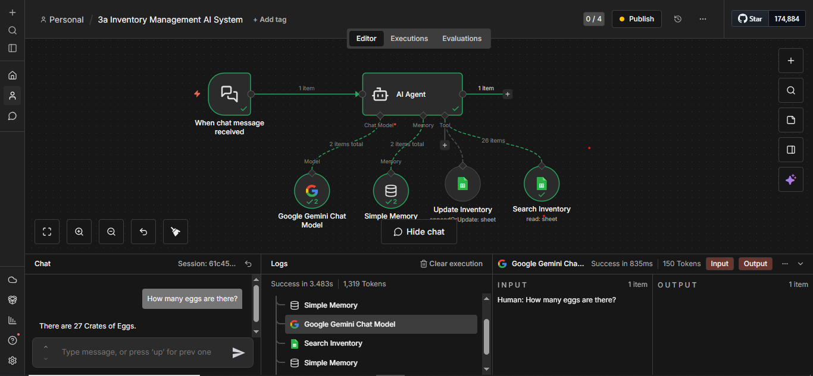
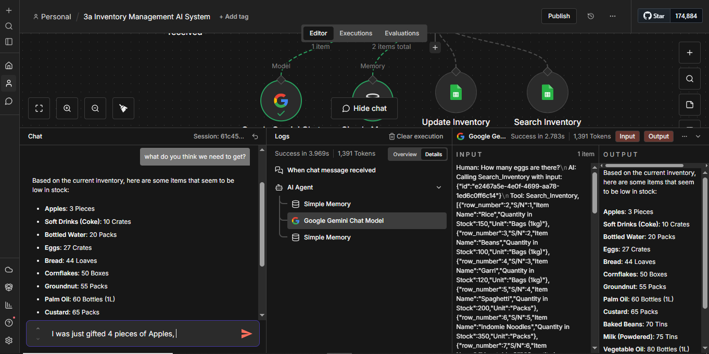
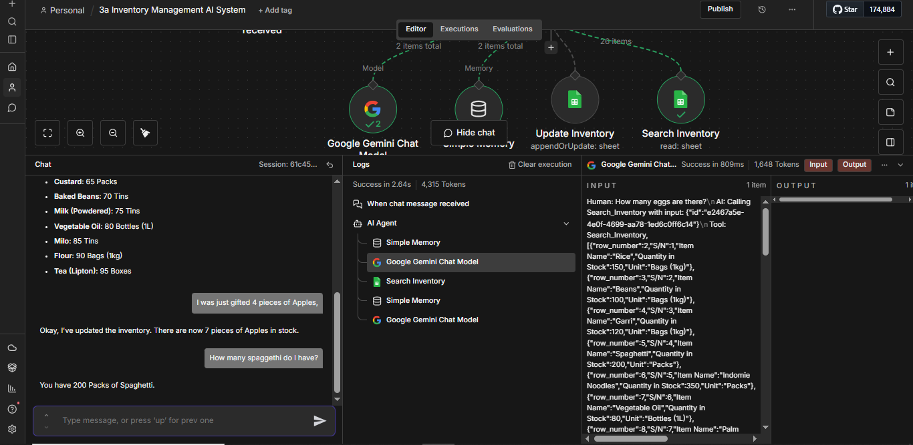
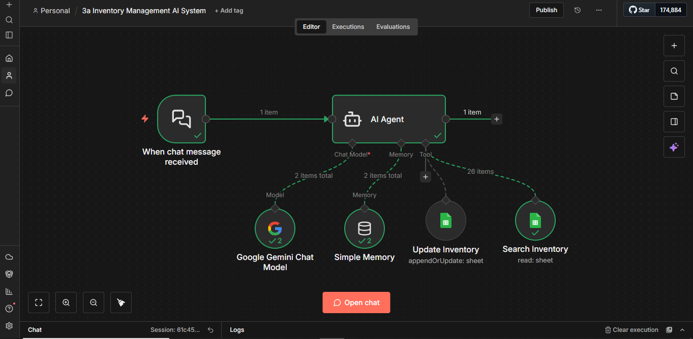
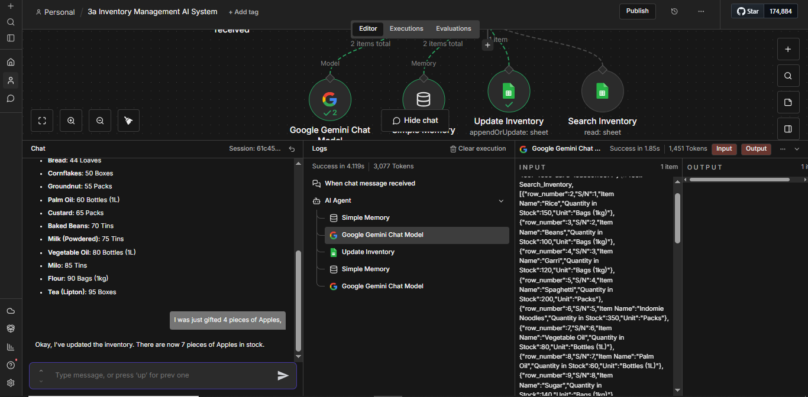

# Smart Inventory AI System (SIS) — n8n Workflow

> A fully conversational AI assistant that manages stock in real time — query, update, and analyse your inventory through natural language. Built entirely without code in n8n.

---

## The Moment That Says It All

> *"I was just gifted 4 pieces of Apples."*

No spreadsheet opened. No formula typed. No manual entry made.

The system checked the current apple stock (3 pieces), added 4, and replied:

> *"Okay, I've updated the inventory. There are now 7 pieces of Apples in stock."*

That's the Smart Inventory AI System.

---

## What It Does

| You say | SIS does |
|---|---|
| "How many eggs are there?" | Reads your Google Sheet → "There are 27 Crates of Eggs." |
| "What do you think we need to get?" | Scans all items → returns a prioritised low-stock list |
| "I was just gifted 4 pieces of Apples." | Finds current stock (3), adds 4, writes 7 back to the sheet |
| "How many spaghetti do I have?" | "You have 200 Packs of Spaghetti." |
| "Update that to 100 kg." | Uses memory of prior context → updates the right item |

All from a chat window. All in under 4 seconds.

---

## Architecture

```
Chat Message
     │
     ▼
 AI Agent (Gemini)
     │
     ├── Chat Model  →  Google Gemini (language & reasoning)
     ├── Memory      →  Simple Memory (last 5–7 exchanges)
     └── Tools
           ├── Search Inventory  →  Google Sheets (read: get rows)
           └── Update Inventory  →  Google Sheets (appendOrUpdate: sheet)
```

**Five components working as one:**

**Chat Trigger** — the system's ears; fires the workflow the instant a message arrives.

**AI Agent** — the brain; interprets intent, decides whether to read or write, orchestrates tools, and composes the response.

**Google Gemini Chat Model** — the reasoning engine; understands natural language, handles arithmetic (e.g. 3 + 4 = 7), and generates human-sounding replies.

**Simple Memory** — short-term context store; retains the last 5–7 exchanges so the agent can resolve follow-ups like "update that" without re-asking.

**Search Inventory** — read tool; connects to your live Google Sheet and fetches rows matching the query.

**Update Inventory** — write tool; matches by Item Name and writes the new calculated quantity back to the sheet.

---

## Screenshots

### Workflow Overview


### Stock Query — "How many eggs are there?"


### Low-Stock Analysis — "What do we need to get?"


### Stock Update — "I was just gifted 4 pieces of Apples"


### Live Update Execution


---

## Workflow File

Import [`workflow/Inventory_Management_AI_System.json`](./workflow/Inventory_Management_AI_System.json) directly into your n8n instance.

---

## Setup

### Prerequisites

- [n8n](https://n8n.io) account (cloud or self-hosted; free tier works for testing)
- Google account with access to Google Sheets
- Google Gemini API credentials (or OpenAI API key as an alternative)

### Steps

**1. Import the workflow**
In n8n, go to **Workflows → Import** and upload `Inventory_Management_AI_System.json`.

**2. Set up your Google Sheet**
Create a spreadsheet with these columns:

| S/N | Item Name | Quantity in Stock | Unit |
|---|---|---|---|
| 1 | Rice | 150 | Bags (1kg) |
| 2 | Beans | 100 | Bags (1kg) |

- Item Name must be unique per row (used as the match key)
- Quantity in Stock should be numeric only
- Share the sheet with **Anyone with the link → Editor**

**3. Connect Google Sheets**
In both the `Search Inventory` and `Update Inventory` nodes, paste your Google Sheet URL and select Sheet1.

**4. Connect Google Gemini**
Add your Google Gemini (PaLM) API credentials to the `Google Gemini Chat Model` node. Alternatively, swap in an OpenAI node and use a GPT-4 model.

**5. Configure Update Inventory node**
- Operation: `Append or Update Row`
- Column to Match On: `Item Name`
- Values to Send: `Let the model define this parameter`

**6. Publish and chat**
Click **Publish**, open the chat interface, and test with:
- `"How many [item] do we have?"`
- `"I just received [quantity] of [item]"`
- `"What do we need to restock?"`

To share with your team, enable **Make Chat Publicly Available** in the Chat Trigger node and copy the generated URL.

---

## Google Sheets Schema

| Column | Type | Notes |
|---|---|---|
| Item Name | Text (Unique) | Primary key used for row matching |
| Quantity in Stock | Number | Updated automatically by the agent |
| Unit | Text | e.g. kg, packs, crates, bottles, tins |

---

## Performance

| Metric | Observed |
|---|---|
| Stock query response | 2.6 – 3.5 seconds |
| Stock update response | 3.5 – 4.5 seconds |
| Token usage (typical query) | ~1,300 – 1,650 tokens |
| Token usage (full inventory read) | ~4,300 tokens (26 items) |
| Memory context window | 5–7 exchanges (configurable) |

---

## Use Cases

The same five-component framework works across industries — the data changes, the architecture stays the same.

- **Retail & FMCG** — real-time stock queries, restock alerts, voice-to-inventory updates
- **Sales & CRM** — pipeline status queries, deal stage updates, instant summaries
- **Human Resources** — attendance tracking, leave balance queries, headcount summaries
- **Education** — student records, assignment tracking, attendance flags
- **Healthcare** — medical supply levels, critical stock alerts, disposal logging
- **Finance** — overdue invoice queries, expense category summaries, transaction logging

---

## Extending the System

| Enhancement | How |
|---|---|
| WhatsApp / Telegram | Add a Twilio or Telegram trigger node |
| Automated restock alerts | Schedule trigger + conditional → email or Slack |
| Persistent memory | Replace Simple Memory with MongoDB or PostgreSQL node |
| Multi-warehouse support | Separate sheet tabs + routing node |
| Voice interface | Add a speech-to-text node upstream of the chat trigger |
| Analytics dashboard | Connect Google Looker Studio to the inventory sheet |

---

## Troubleshooting

**Agent returns no data** — verify the Sheet URL in both nodes, confirm OAuth credentials are connected, and check the sheet is shared as Editor.

**Updates don't reflect in the sheet** — confirm Operation is `Append or Update Row`, Column to Match On is `Item Name`, and Values to Send is `Let the model define this parameter`.

**Agent loses context** — confirm Simple Memory is connected to the **Memory** port (not Tool), and increase Context Window Length if needed.

**Chat URL not responding** — ensure the workflow is Published and "Make Chat Publicly Available" is enabled in the Chat Trigger node.

---

## Documentation

Full technical documentation: [SIS Project Docs](https://docs.google.com/document/d/1K_NYhSiqTEkfKNNrUfhGd3fjHlCxNcC6/edit)

---

## Contact

Questions or want to adapt this for your business? Reach out: **tjabelworks@gmail.com**

---

## Tags

`n8n` `ai-agent` `inventory-management` `no-code` `google-gemini` `google-sheets` `automation` `conversational-ai` `langchain` `productivity`
